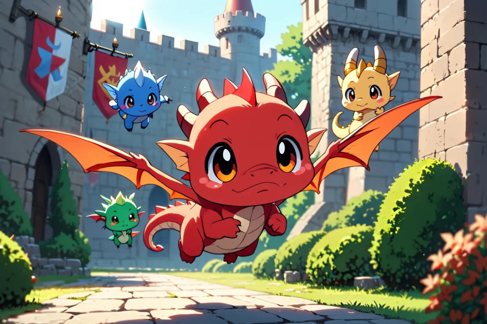

# Dragon Skies 🐉☄️



A multiplayer 3D dragon flight combat game where you control a dragon that grows as you collect experience points and battle other players.

## Overview

Dragon Skies is a web-based multiplayer game built with Three.js and TypeScript. Players spawn as baby dragons in a medieval-inspired open world, flying through the skies to collect experience orbs and engaging in aerial combat with fireballs.

## Features

- **Dragon Flight**: Control your dragon with WASD keys, mouse for camera/aiming, spacebar to ascend, and shift to descend
- **Progression System**: Collect experience orbs to level up from baby to formidable dragon (10 levels)
- **Combat**: Engage in aerial battles using fireballs against other players
- **Multiplayer**: Real-time gameplay with other players via WebSocket
- **Dynamic Environment**: Medieval-themed world with castles, villages, forests, and mountains

## Tech Stack

- **Frontend**: Three.js, TypeScript
- **Build Tool**: Vite
- **Networking**: Socket.IO
- **Server**: Node.js with HTTPS/WSS

## Getting Started

### Prerequisites

- Node.js (latest LTS version)
- SSL certificates for secure WebSocket connections

### Installation

1. Clone the repository
```bash
git clone https://github.com/yourusername/dragon-skies.git
cd dragon-skies
```

2. Install dependencies
```bash
npm install
```

3. Configure SSL certificates
   - Place your SSL key at `/etc/ssl/private/key.pem` or set the `SSL_KEY_PATH` environment variable
   - Place your SSL certificate at `/etc/ssl/certs/cert.pem` or set the `SSL_CERT_PATH` environment variable

### Development

Start the development server:
```bash
npm run dev
```

Run the WebSocket server:
```bash
npm run server
```

### Building

Build for production:
```bash
npm run build
```

## Game Mechanics

- **Growth**: Dragons increase in size and health as they level up
- **Health System**: Base 100 HP at Level 1, +20 HP per level, regenerates 1 HP per second
- **Fireball Combat**: Base 10 damage + 1 per level with a 2-second cooldown
- **Death & Reset**: When health reaches zero, player dies and resets to Level 1

## Controls

- **W/A/S/D**: Up/Left/Down/Right movement
- **Spacebar**: Shoot fireball

## Note

Most of the code for Dragon Skies was written by Claude 3.7, an AI assistant. 
